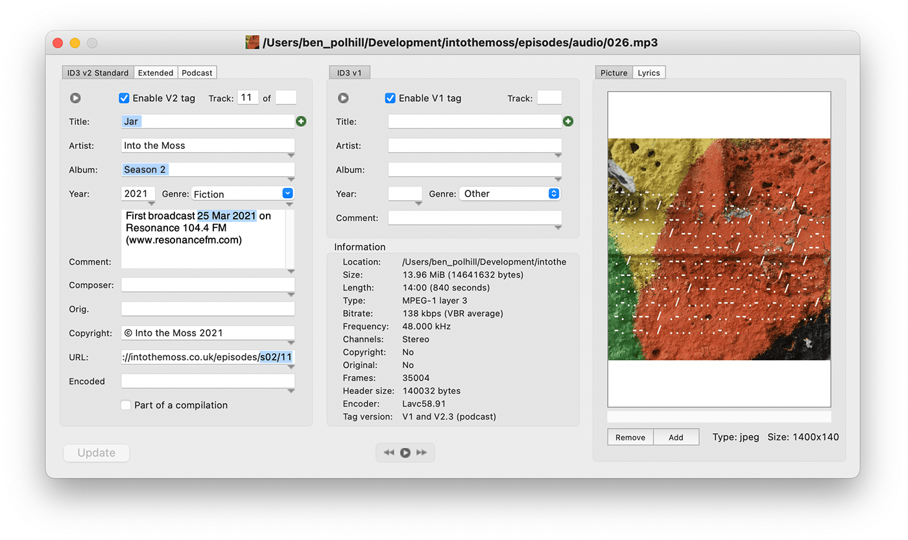
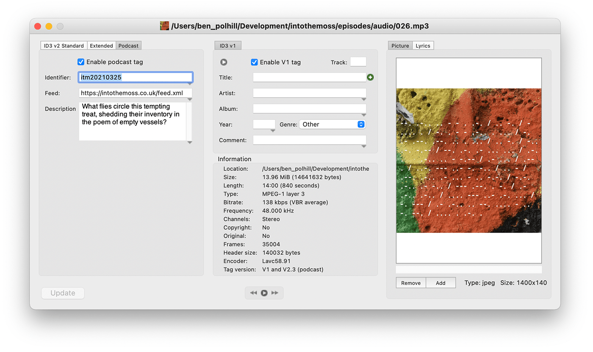

# Into the Moss Website

## Podcast release workflow
### 1. Encode the MP3

The podcast MP3 should be encoded for optimised streaming. Use VBR quality 5. This can be done with [FFmpeg](https://ffmpeg.org/download.html) using this command:
```bash
ffmpeg -i 001.wav -c:a libmp3lame -q:a 5 001.mp3
``` 
The MP3 is then saved in `/episodes/audio/[EPISODE_NUMBER].mp3`. EPISODE_NUMBER is three digits, i.e. 022.mp3.
### 2. Save episode artwork

The images should be exported as Jpeg at 1400x1400, with quality set around 10, so file size is kept below 200K. The image is saved in `/episodes/images/[EPISODE_NUMBER].jpg` 
### 3. Tag the MP3

Use the [ID3 Editor](http://www.pa-software.com/id3editor/) and ensure the following fields are filled in:
- Title
- Album (i.e. Season)
- Comment (must include date in format: DD Mon YYYY)
- URL (including season/episode number)
- Identifier (in Podcast tab, format: itmYYYYMMDD)
- Description (in Podcast tab)

Other fields (like image) may be filled, but are not essential for the feed build. See screenshots below for what to fill in.


### 4. Create RSS feed file

The podcasts are published via [RSS feed](https://rss.com/blog/how-do-rss-feeds-work/) using the XML file at [intothemoss.co.uk/feed.xml](https://intothemoss.co.uk/feed.xml). This is the feed registered with the podcast providers (Google/Apple/Stitcher/etc.).

The XML file is built using the [ID3 metadata](https://help.podbean.com/support/solutions/articles/25000021709-what-is-an-id3-tag-) in each MP3, by running the buildXML script:
```bash
./buildXML.sh 
```
This script loops through each MP3 file in the `/episodes/audio` folder, parsing the relevant ID3 tags (title, description, link etc) and adding them to the XML feed. The feed must conform to [Apple's technical requirements](https://itunespartner.apple.com/podcasts/articles/podcast-requirements-3058), so it's important to tag each MP3 correctly. If you're healthily paranoid, use an [XML validator](https://castfeedvalidator.com/?url=https://intothemoss.co.uk/feed.xml) after generating the feed. 
### 5. Push this repository

The final step is to push this repository to Github: `git push`.

The `main` branch of the repository is pulled by the intothemoss.co.uk host server every Thursday at 18:30 via the following cron task:
```bash
30 18 * * 4 su -s /bin/sh root -c 'cd /var/www/html/intothemoss.co.uk/ && /usr/bin/git pull origin main'
```
